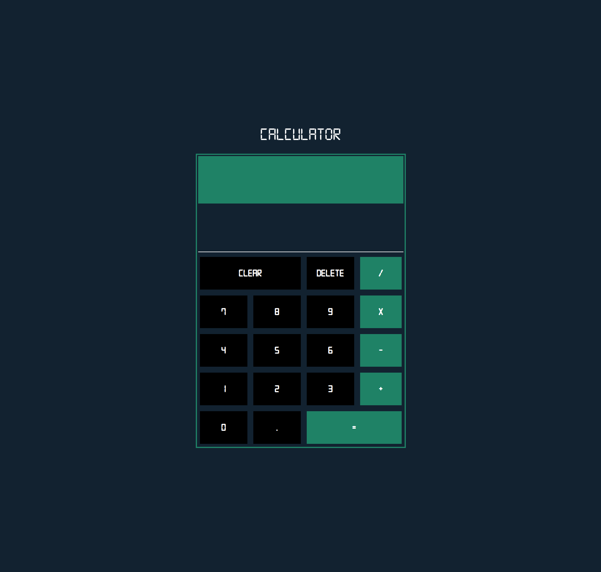

# [calculator](https://kojokwakye.github.io/calculator/)

a basic calculator on the web. it was built for the odin project

## features

- addition, subtraction, multiplication, and division.
- clear and delete functionality.

## usage

- click numbers and operators to perform calculations.
- use "clear" to reset the screen.
- use "delete" to remove the last character

